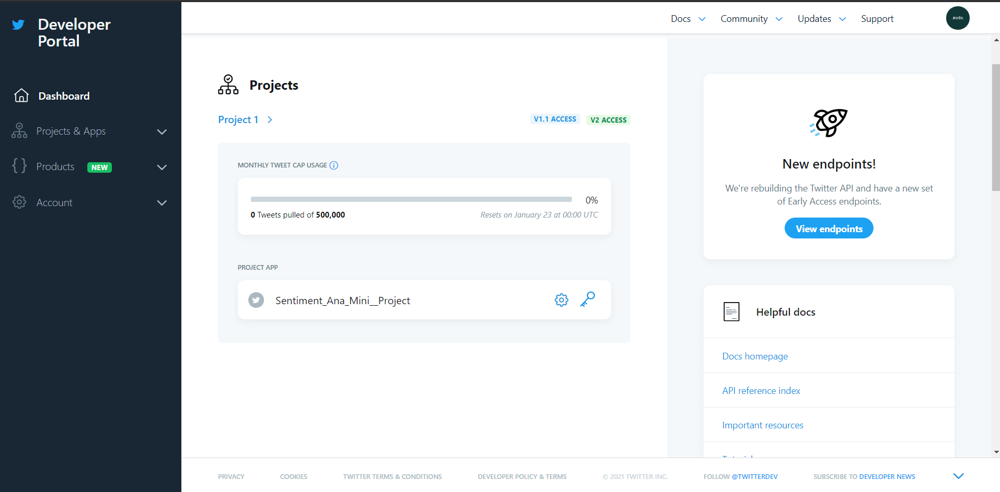
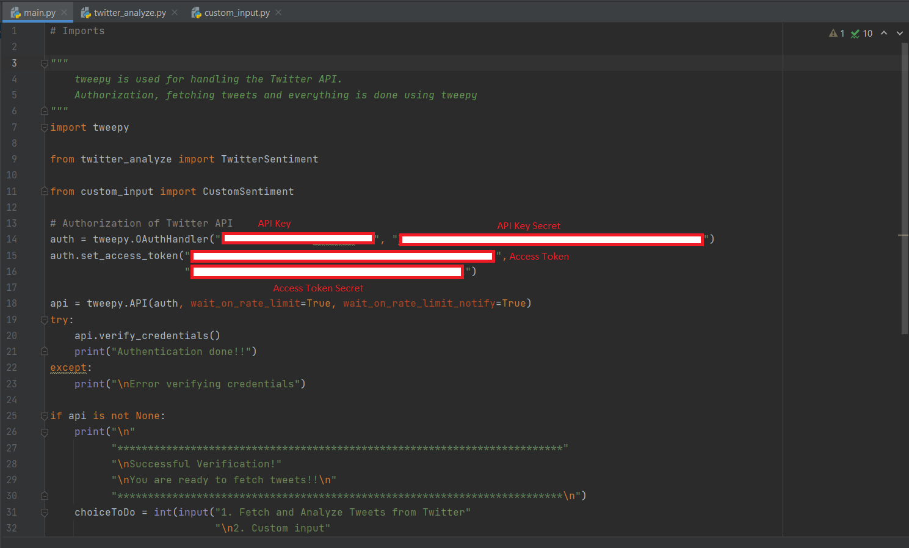

# Twitter-Sentiment-Analysis
Mini-Project for Twitter Sentiment Analysis using Twitter API

# Twitter API Keys
  - Goto [Twitter Developer Dashboard](https://developer.twitter.com/en/portal/dashboard) and register using your Twitter Account <br>
  - Twitter will ask for some details like Why you need key?, etc etc...fill it <br>
  - After that you will be redirected to Dashboard where you can generate your API Keys <br>
   <br>
  - Now you have to input the keys into main.py <br>
   <br>
  
# How to run?

```
pip install -r requirements.txt
python main.py
